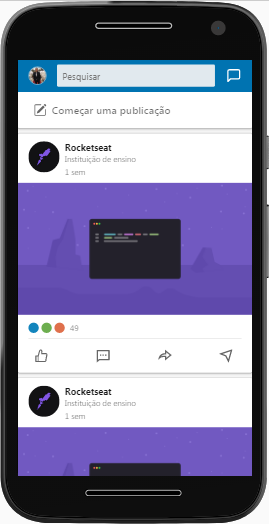
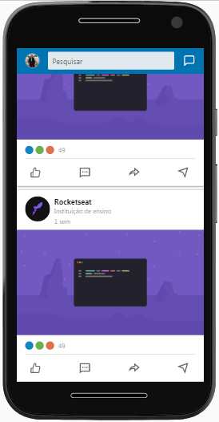
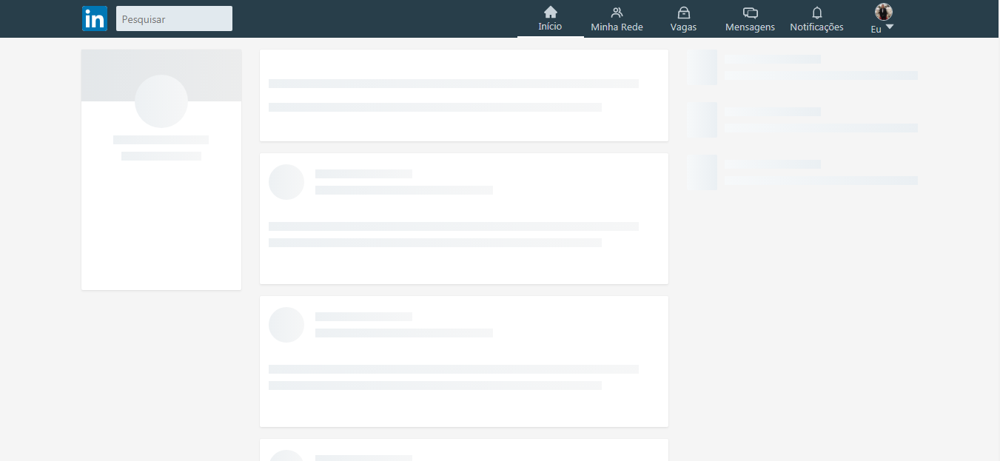
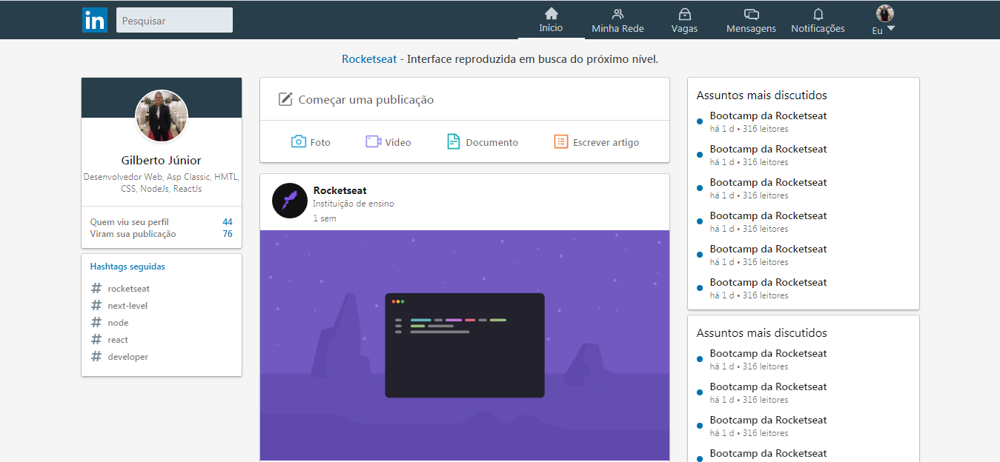
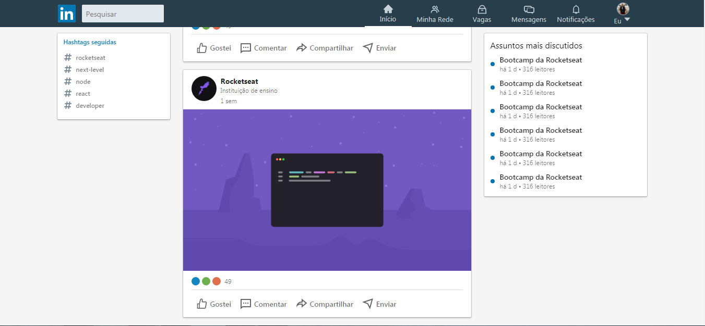

# Interface Linkedin com ReactJs | UI Clone

# 📔 Sobre

Criação da página inicial do [Linkdin](https://www.linkedin.com/) com o ReackJs.

Foi usada a propriedade `Shimmer Effect`.

## Função da propriedade `Shimmer Effect`:

### **Shimmer Effect** é a **propriedade** de efetio quando a página esta carregando.

---
# 🌎 API
## API Desenvolvida com: 

    ReactJS
    -   Foi usado o --template=typescript

---

## Dependências: 

    react-icons,
    styled-components,
    typescript,

---

## Dependências de Desenvolvimento: 
     devDependencies: {
        @types/react-icons,
        @types/styled-components,
    }

---

## Após fazer o clone do projeto, no diretório do projeto, você pode executar: 

### `npm start` ou `yarn start`

Ao executar o aplicativo, o projeto vai abrir automaticamente no endereço http://localhost:3000.

Qualquer edição que você fizer no arquivo, a página sera recarregada.

Você também verá os erros no console.

---

## 📱 Versão Mobile

---

## 💻 Web

---
<h1 align="center">💻 Desenvolvido Por: Gilberto Júnior</h1> 